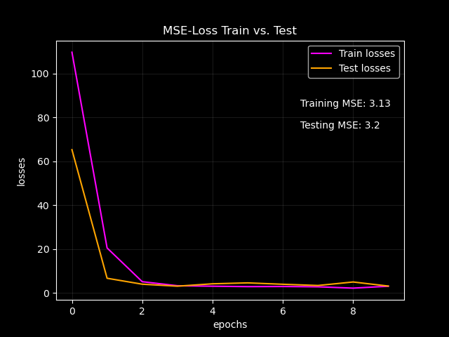

# Student Performance

## Introduction

This machine learning project focuses on building and training an artificial neural network using PyTorch to predict students' performance in secondary education from attributes including student grades, demographic, social and school related features. Data for this project was collected from [UC Irvine Machine Learning Repository](https://archive.ics.uci.edu/dataset/320/student+performance) and was preprocessed using pandas, numpy and scikit-learn. A transformation pipeline was built to handle categorical and numerical transformation conveniently. A Feed-Forward-Network was designed using linear and batch normalization layers. The trained scikit-learn transformers and network parameters were saved for later use. The model will be deployed as a web application for educational purposes.

## Results

- The training loss and test loss curves are both decreasing over time, which indicates that the model is learning.
- The training loss and the test loss are close to each other and the former is below the latter, which indicates that the model is not overfitting to the training data.
- The test loss is relatively low, which indicates that the model is able to generalize well to unseen data.

## Usage
The model is not deployed yet. It will be available as a free web service.

## References

1. Cortez,Paulo. (2014). Student Performance. UCI Machine Learning Repository. https://doi.org/10.24432/C5TG7T.

